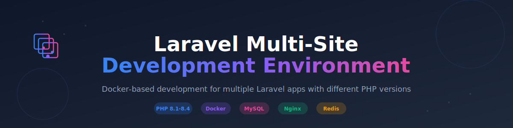

<div align="center">
  
</div>

<br>

# Laravel Multi-Site Development Environment

A Docker-based development environment for running multiple Laravel applications simultaneously with different PHP versions. Perfect for agencies, freelancers, or developers working on multiple Laravel projects.

## 📑 Table of Contents

- [✨ Features](#-features)
- [🚀 Quick Start](#-quick-start)
  - [Prerequisites](#prerequisites)
  - [Initial Setup](#initial-setup)
  - [Adding Your First Site](#adding-your-first-site)
  - [Accessing Your Sites](#accessing-your-sites)
- [📁 Directory Structure](#-directory-structure)
- [🛠️ Common Tasks](#️-common-tasks)
  - [Add a New Site](#add-a-new-site)
  - [List All Sites](#list-all-sites)
  - [Clone an Existing Laravel Project](#clone-an-existing-laravel-project)
  - [Remove a Site](#remove-a-site)
  - [Run Artisan Commands](#run-artisan-commands)
  - [Run Composer Commands](#run-composer-commands)
  - [Access MySQL](#access-mysql)
  - [Start/Stop Environment](#startstop-environment)
  - [Shell Aliases](#shell-aliases)
  - [Active Development Workflow](#active-development-workflow)
- [🔧 Configuration](#-configuration)
  - [Customise Nginx Virtual Hosts](#customise-nginx-virtual-hosts)
  - [Environment Variables](#environment-variables)
  - [PHP Configuration](#php-configuration)
  - [Installing Additional PHP Extensions](#installing-additional-php-extensions)
  - [Nginx Configuration](#nginx-configuration)
- [🎯 Use Cases](#-use-cases)
- [📊 Container Resources](#-container-resources)
- [🔍 Monitoring & Health Checks](#-monitoring--health-checks)
- [🐛 Troubleshooting](#-troubleshooting)
- [🔐 Security Notes](#-security-notes)
- [📚 Additional Resources](#-additional-resources)
- [🤝 Contributing](#-contributing)
- [📄 License](#-license)

## ✨ Features

- **Multiple PHP Versions**: Run PHP 8.1, 8.2, 8.3, and 8.4 simultaneously
- **Multi-Site Support**: Host unlimited Laravel applications in one environment
- **Isolated Databases**: Each site can have its own MySQL database and user
- **Laravel 12 Starter Kits**: React (TypeScript, shadcn/ui), Vue (TypeScript, shadcn-vue), or Livewire (Flux UI) - PHP 8.4 only
- **Easy Site Management**: Interactive CLI tool to add, list, and remove sites
- **Nginx Virtual Hosts**: Automatic nginx configuration per site
- **Development Ready**: MySQL, Redis, and all PHP extensions pre-configured

## 🚀 Quick Start

### Prerequisites

- Docker Engine 20.10+ ([Install Docker](https://docs.docker.com/engine/install/))
- Docker Compose 2.0+ (included with Docker Desktop)

### Initial Setup

```bash
# Clone the repository
git clone https://github.com/yourusername/laravel-multisite-docker.git
cd laravel-multisite-docker

# Run the setup script
./setup.sh
```

The script will:
1. Initialize the Docker environment
2. Create necessary configuration files
3. Start all containers (nginx, MySQL, Redis, PHP 8.1-8.4)

### Adding Your First Site

Once the environment is initialized, use the setup script to add a new site:

```bash
./setup.sh
# Select option 1) Add new site
```

Select option `1) Add new site` and follow the prompts:

1. **Site Name**: Enter a name (e.g., `myapp`)
2. **Domain**: Enter domain (e.g., `myapp.test`) 
3. **PHP Version**: Choose PHP 8.1, 8.2, 8.3, or 8.4
4. **Database**: Optionally create a database and user
5. **Laravel**: Create new Laravel project or clone existing one
6. **Starter Kit** (PHP 8.4 only): Choose React, Vue, Livewire, or blank Laravel

> **Note:** Laravel Breeze starter kits (React, Vue, Livewire) are only available when using PHP 8.4 to ensure compatibility with the latest frontend tooling and dependencies.

### Example: Adding a Site

```
Site Name: portfolio
Domain: portfolio.test
PHP Version: PHP 8.4
Database: Yes
  - Database name: portfolio
  - Database user: portfolio_user
  - Password: (auto-generated)
Laravel: Create new Laravel project
```

The script will:
- Create a virtual host configuration
- Create the database and user
- Install Laravel (if selected)
- Save database credentials to `sites/portfolio/.env.credentials`

### Accessing Your Sites

#### Option 1: Edit /etc/hosts (Simple)

Add the domain to your `/etc/hosts` file:

```bash
# Edit hosts file (requires sudo)
sudo nano /etc/hosts

# Add this line:
127.0.0.1  myapp.test
```

Then visit `http://myapp.test` in your browser!

#### Option 2: Nginx Proxy Manager (Recommended for Multiple Sites)

[Nginx Proxy Manager](https://nginxproxymanager.com/) provides a web UI for managing domains and SSL certificates:

1. Install Nginx Proxy Manager (separate Docker container)
2. Point it to your sites on `webserver:80`
3. Manage domains and SSL through the web interface
4. Access sites via custom domains with automatic HTTPS

#### Option 3: Cloudflare Tunnel (Remote Access)

[Cloudflare Tunnel](https://www.cloudflare.com/products/tunnel/) allows secure access without exposing ports:

1. Install `cloudflared` in your environment
2. Create tunnels for each site pointing to `localhost:80`
3. Access your sites via public Cloudflare URLs
4. Share sites with clients for review without deployment

Both options eliminate the need to edit `/etc/hosts` and can provide HTTPS certificates automatically.

## 📁 Directory Structure

```
.
├── docker-compose.yml          # Docker services configuration
├── setup.sh                    # Interactive site management script
├── sites/                      # Your Laravel applications go here
│   ├── myapp/                 # Example site
│   ├── portfolio/             # Another site
│   └── client-project/        # Yet another site
├── config/
│   └── vhosts/                # Nginx virtual host configs
│       ├── site.conf.template # Template for new sites
│       ├── myapp.conf         # Auto-generated vhost
│       └── portfolio.conf     # Auto-generated vhost
└── services/
    ├── nginx/                 # Nginx Dockerfile
    └── php-fpm/              # PHP Dockerfiles
        ├── php8.1/
        ├── php8.2/
        ├── php8.3/
        └── php8.4/
```

## 🛠️ Common Tasks

### Add a New Site

```bash
./setup.sh
# Select: 1) Add new site
# Follow the prompts for site name, domain, PHP version, database, and Laravel setup
```

### List All Sites

```bash
./setup.sh
# Select: 2) List sites
```

### Clone an Existing Laravel Project

```bash
cd sites
git clone https://github.com/yourname/your-laravel-app.git myapp
cd ..

# Now add vhost and database
./setup.sh
# Select: 1) Add new site
# When asked about Laravel, choose: 2) I'll clone an existing project manually
```

### Remove a Site

```bash
./setup.sh
# Select: 3) Remove site
```

This removes the vhost config and optionally the database. Site files remain in `sites/` for manual cleanup.

### Run Artisan Commands

```bash
# For PHP 8.4 site
docker compose exec php84 php /var/www/sites/myapp/artisan migrate

# For PHP 8.3 site
docker compose exec php83 php /var/www/sites/another-app/artisan migrate

# Or enter the container
docker compose exec php84 sh
cd /var/www/sites/myapp
php artisan migrate
```

### Run Composer Commands

```bash
# Install dependencies for a site
docker compose exec php84 composer install -d /var/www/sites/myapp

# Update packages
docker compose exec php84 composer update -d /var/www/sites/myapp
```

### Access MySQL

#### Option 1: Via Docker Exec (No Port Needed)
```bash
# Connect from host machine
docker compose exec mysql mysql -u root -p

# Connect from PHP container
docker compose exec php84 sh
mysql -h mysql -u root -p
```

#### Option 2: Via External Client (Requires Port Mapping)

To connect with GUI tools like MySQL Workbench, TablePlus, or Sequel Pro, expose MySQL port:

1. Edit `docker-compose.yml` and add ports under the `mysql` service:
   ```yaml
   mysql:
     image: mysql:8.0
     ports:
       - "3306:3306"  # Add this line
   ```

2. Restart MySQL:
   ```bash
   docker compose restart mysql
   ```

3. Connect with your client:
   - **Host:** 
     - `localhost` or `127.0.0.1` (if running locally)
     - `your-server-ip` (if running on remote development server)
   - **Port:** `3306`
   - **Username:** `root` (or check your `.env`)
   - **Password:** From `.env` file (`MYSQL_ROOT_PASSWORD`)

**Note:** Each site has its own database credentials saved in `credentials/{sitename}.env`

### Start/Stop Environment

```bash
# Start all containers
docker compose up -d

# Stop all containers
docker compose down

# View logs
docker compose logs -f

# Restart a specific service
docker compose restart webserver
```

### Shell Aliases

The setup script can create convenient shell aliases for faster container access. Run the setup script and select option `5) Create shell aliases` to add them to your shell profile.

**Available aliases:**

| Alias | Command | Description |
|-------|---------|-------------|
| `php81` | `docker compose exec php81 sh` | Enter the PHP 8.1 container |
| `php82` | `docker compose exec php82 sh` | Enter the PHP 8.2 container |
| `php83` | `docker compose exec php83 sh` | Enter the PHP 8.3 container |
| `php84` | `docker compose exec php84 sh` | Enter the PHP 8.4 container |
| `dclogs` | `docker compose logs -f` | Follow all container logs |
| `dcrestart` | `docker compose restart` | Restart all containers |

**Usage examples:**

```bash
# Enter PHP 8.4 container directly
php84

# Then run commands inside
cd /var/www/sites/myapp
php artisan migrate
composer install

# View logs from any directory
dclogs

# Quick restart after config changes
dcrestart
```

**Note:** After creating aliases, reload your shell profile or open a new terminal:

```bash
source ~/.zshrc   # for Zsh
source ~/.bashrc  # for Bash
```

### Active Development Workflow

When actively developing a single site, you'll typically need these running in separate terminal tabs:

#### Terminal 1: Vite Dev Server (for frontend assets)
```bash
docker compose exec php84 sh
cd /var/www/sites/myapp
npm install  # first time only
npm run dev
```

#### Terminal 2: Queue Worker (for background jobs)
```bash
docker compose exec php84 php /var/www/sites/myapp/artisan queue:work --tries=3
```

#### Terminal 3: Scheduler (for scheduled tasks)
```bash
# For development, run every minute manually:
docker compose exec php84 sh
cd /var/www/sites/myapp
while true; do php artisan schedule:run; sleep 60; done

# Or use Laravel's schedule:work (Laravel 8+):
php artisan schedule:work
```

**Tip**: These are only needed when actively developing that specific site. You can run them as needed and stop them when switching to a different project.

## 🔧 Configuration

### Customise Nginx Virtual Hosts

The setup script uses `config/vhosts/site.conf.template` to generate nginx configs for each site. You can customise this template:

```bash
# Edit the template
nano config/vhosts/site.conf.template
```

**Important:** Keep the placeholders intact:
- `{SITE_NAME}` - Replaced with your site directory name
- `{DOMAIN}` - Replaced with your chosen domain
- `{PHP_VERSION}` - Replaced with selected PHP version (81, 82, 83, 84)

**Customisation examples:**
- Add custom headers
- Configure client_max_body_size for large uploads
- Add rate limiting
- Custom logging format
- Additional location blocks
- SSL configuration (for reverse proxy setups)

After editing the template, new sites will use your custom configuration. Existing sites will need vhost regeneration:

```bash
# Remove and re-add the site to regenerate vhost
./setup.sh
# Option 3: Remove site (keep files and database)
# Option 1: Add site (use existing directory)
```

### Environment Variables

Edit `.env` file to configure:

```bash
# User permissions (auto-detected)
UID=1000
GID=1000

# MySQL root password
MYSQL_ROOT_PASSWORD=generated_password

# MySQL performance tuning
MYSQL_INNODB_BUFFER_POOL_SIZE=1G
MYSQL_INNODB_LOG_FILE_SIZE=256M
```

### PHP Configuration

Edit PHP settings in `services/php-fpm/php*/php.ini`:

```ini
upload_max_filesize = 1024M
post_max_size = 1024M
memory_limit = 2048M
max_execution_time = 300
```

After changes, rebuild:

```bash
docker compose up -d --build
```

### Installing Additional PHP Extensions

The Docker images come pre-installed with common Laravel extensions:
- **Core**: PDO, MySQLi, PDO_MySQL, PDO_PostgreSQL, MBString, Zip, Exif
- **Image Processing**: GD, Imagick
- **Performance**: OPcache, BCMath
- **Cache**: Redis
- **Other**: Intl, PCNTL

If you need additional extensions, edit the appropriate Dockerfile in `services/php-fpm/php*/Dockerfile`:

**For standard PHP extensions:**

```dockerfile
# Find this line in the Dockerfile
&& docker-php-ext-install -j$(nproc) \
    pdo \
    pdo_mysql \
    # Add your extension here
    soap \
    sockets \
```

**For PECL extensions:**

```dockerfile
# Find this line in the Dockerfile
&& pecl install redis imagick \
    # Add your PECL extension
    && pecl install mongodb xdebug \
    && docker-php-ext-enable redis imagick mongodb xdebug \
```

**Example: Adding MongoDB support to PHP 8.4:**

1. Edit `services/php-fpm/php8.4/Dockerfile`
2. Find the PECL install section
3. Add `mongodb`:
   ```dockerfile
   && pecl install redis imagick mongodb \
   && docker-php-ext-enable redis imagick mongodb \
   ```
4. Rebuild the container:
   ```bash
   docker compose up -d --build php84
   ```

**Common extensions and their install commands:**

| Extension | Type | Install Command |
|-----------|------|-----------------|
| SOAP | Core | `docker-php-ext-install soap` |
| Sockets | Core | `docker-php-ext-install sockets` |
| MongoDB | PECL | `pecl install mongodb` |
| Xdebug | PECL | `pecl install xdebug` |
| APCu | PECL | `pecl install apcu` |
| Memcached | PECL | `pecl install memcached` |

**Note:** Some extensions require additional system libraries. Add them to the `apk add` section if needed.

### Nginx Configuration

The template is at `config/vhosts/site.conf.template`. Changes affect new sites only. To update existing sites, edit their `.conf` files directly and reload nginx:

```bash
docker compose exec webserver nginx -s reload
```

## 🎯 Use Cases

### Scenario 1: Multiple Client Projects

```bash
./setup.sh  # Add client1, PHP 8.4
./setup.sh  # Add client2, PHP 8.3
./setup.sh  # Add client3, PHP 8.2
```

Access at `client1.test`, `client2.test`, `client3.test`

### Scenario 2: Legacy App Migration

```bash
# Old app on PHP 8.1
./setup.sh  # Add oldapp, PHP 8.1

# New version on PHP 8.4
./setup.sh  # Add newapp, PHP 8.4
```

Test both versions side-by-side!

### Scenario 3: Package Development

```bash
# Test package on multiple PHP versions
./setup.sh  # Add test-php81, PHP 8.1
./setup.sh  # Add test-php82, PHP 8.2
./setup.sh  # Add test-php83, PHP 8.3
./setup.sh  # Add test-php84, PHP 8.4
```

## 📊 Container Resources

Default resource limits per service:

- **Nginx**: 512MB RAM, 1 CPU
- **PHP containers**: 2GB RAM each, 2 CPUs each
- **MySQL**: 2GB RAM, 2 CPUs
- **Redis**: 512MB RAM, 1 CPU

Adjust in `docker-compose.yml` under `deploy.resources`.

## � Monitoring & Health Checks

All services include Docker health checks that monitor their status. Additionally, an HTTP health endpoint is available for external monitoring tools.

### HTTP Health Endpoint

The webserver exposes a health check endpoint at:

```
http://localhost/health
```

**Response:**
```
HTTP/1.1 200 OK
Content-Type: text/plain

healthy
```

This endpoint can be used with monitoring tools like:
- **Uptime Kuma** - Self-hosted monitoring
- **Prometheus** - Metrics collection
- **Nagios/Icinga** - Infrastructure monitoring
- **Grafana** - Dashboards and alerting
- **AWS CloudWatch** - Cloud monitoring
- **Datadog/New Relic** - APM solutions

### Docker Health Check Status

View the health status of all containers:

```bash
docker compose ps
```

Output shows health status:
```
NAME        STATUS
webserver   Up 5 minutes (healthy)
php84       Up 5 minutes (healthy)
php83       Up 5 minutes (healthy)
php82       Up 5 minutes (healthy)
php81       Up 5 minutes (healthy)
mysql       Up 5 minutes (healthy)
redis       Up 5 minutes (healthy)
```

### Service-Specific Health Checks

Each service has its own health check mechanism:

| Service | Health Check Method | Interval | Timeout |
|---------|-------------------|----------|---------|
| Nginx | `curl http://localhost/health` | 30s | 5s |
| PHP-FPM | `php-fpm -t` | 30s | 5s |
| MySQL | `mysqladmin ping` | 10s | 5s |
| Redis | `redis-cli ping` | 10s | 5s |

### Monitoring Setup Example (Uptime Kuma)

1. Install Uptime Kuma:
   ```bash
   docker run -d --restart=always -p 3001:3001 -v uptime-kuma:/app/data --name uptime-kuma louislam/uptime-kuma:1
   ```

2. Access Uptime Kuma at `http://localhost:3001`

3. Add a new monitor:
   - **Monitor Type:** HTTP(s)
   - **Friendly Name:** Laravel Development Environment
   - **URL:** `http://host.docker.internal/health`
   - **Heartbeat Interval:** 60 seconds
   - **Method:** GET
   - **Expected Status Code:** 200

**Note:** Use `host.docker.internal` when monitoring from another Docker container, or `localhost` when monitoring from the host machine.

## �🐛 Troubleshooting

### Port 80 Already in Use

```bash
# Check what's using port 80
sudo lsof -i :80

# Stop the service or change the port in docker-compose.yml
ports:
  - "8080:80"  # Use port 8080 instead
```

### Site Not Loading

1. Check domain in `/etc/hosts`
2. Verify nginx config: `docker compose exec webserver nginx -t`
3. Check logs: `docker compose logs webserver`
4. Ensure containers are running: `docker compose ps`

### Database Connection Issues

1. Check credentials in `sites/yourapp/.env`
2. Ensure MySQL is running: `docker compose ps mysql`
3. Test connection: `docker compose exec mysql mysqladmin ping -u root -p`

### Permission Issues

Files created by Docker may have wrong ownership:

```bash
# Fix ownership (run on host)
sudo chown -R $USER:$USER sites/myapp
```

## 🔐 Security Notes

- **Development Only**: This setup is for local development, not production
- **Passwords**: Keep `.env` file secure, it contains MySQL root password
- **.env.credentials**: Contains database passwords, add to `.gitignore`
- **Port 80**: Only expose port 80 if needed, or use 127.0.0.1:8080 binding

## 📚 Additional Resources

- [Laravel Documentation](https://laravel.com/docs)
- [Docker Documentation](https://docs.docker.com)
- [Nginx Documentation](https://nginx.org/en/docs/)
- [MySQL Documentation](https://dev.mysql.com/doc/)

## 🤝 Contributing

Contributions welcome! Please open an issue or PR.

## 📄 License

MIT License - See LICENSE file for details

## 💬 Support

For issues or questions:
- Open a GitHub issue
- Check existing issues for solutions
- Review Docker and Laravel documentation

---

**Happy Coding! 🚀**
